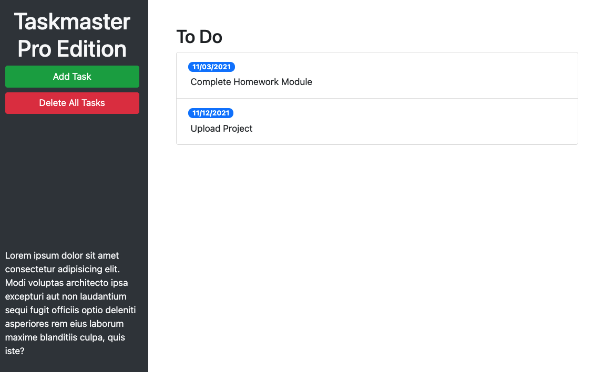

# Taskmaster-Pro

Taskmaster-Pro is a simple Kanban Board that can save tasks locally. It uses a drag and drop user interface, and color coding to indicate when a due date is approaching.

This improved version of the web app includes Bootstrap styles, jQuery utilization, Moment.js, and a better user experience.

## Deployment

https://josh2100.github.io/taskmaster-pro/

## Screenshot

